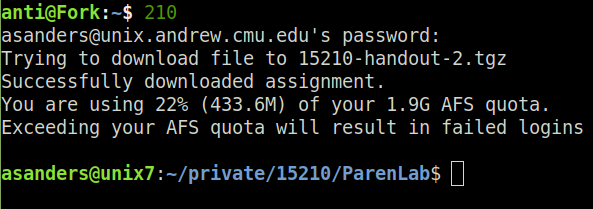

The image below shows how I work on 15-210 homework. I type 210 from terminal,
and new labs are automatically downloaded and extracted. Then I'm placed into
the directory of the newest lab. 

  

In addition, when I'm in a lab folder, I type make to create a handin as usual,
and then submit to submit the lab.

This repository is a reference for anyone else who wants to do this. 

### Auto download and unzip new labs

1. Add the following to ~/.bashrc on the Unix servers:

`export PATH="/afs/cs.cmu.edu/academic/class/15210-s19/diderot-cli:$PATH"`

2. Create a file private/.diderot/credentials, and place your andrew email
address as the first line, and your diderot password as the second line. This
is detailed in the README of diderot-cli.

3. Now if you run the following command, you will get a list of the 15-210
assignments:

`diderot_student list_assignments "15210:F19"`

4. Make sure your folder for 210 has the location/name "private/15210", and that
the folders inside of 15210 for labs you've already downloaded match the names
given by the command from step 3. Case matters!

6. Copy update.sh from this repository into your 210 folder, make it executable,
and run it. Note that it will delete .tgz files in the folder as part of
cleanup, and that undownloaded labs will be downloaded.

`cd ~/private/15210`

`wget https://raw.githubusercontent.com/J3698/auto-15210-download/master/update`

`chmod +x update`

`./update`

Now you can automatically download and extract labs using update.

### Auto call update and cd into most recently edited lab

1. Place the code from the add_to_local_bashrc file in this repository at the end
of the ~/.bashrc file on your local machine, replacing ANDREWID with your andrew
id.

2. If you're on a mac, you may have to put "source ~/.bashrc" at the end of the
~/.bash_profile file.

3. Open a new terminal and run `210` to see the magic happen

### Use submit to submit labs

1. Download the code for the submit command onto the andrew machines

`wget https://raw.githubusercontent.com/J3698/auto-15210-download/master/add_to_andrew_bashrc`

2. Add the code to your andrew ~/.bashrc

`cat add_to_andrew_bashrc >> ~/.bashrc && rm add_to_andrew_bashrc`

3. In a an appropriately named lab folder, run make and then submit (I don't suggest testing this on labs with past due dates, as they will become late).
